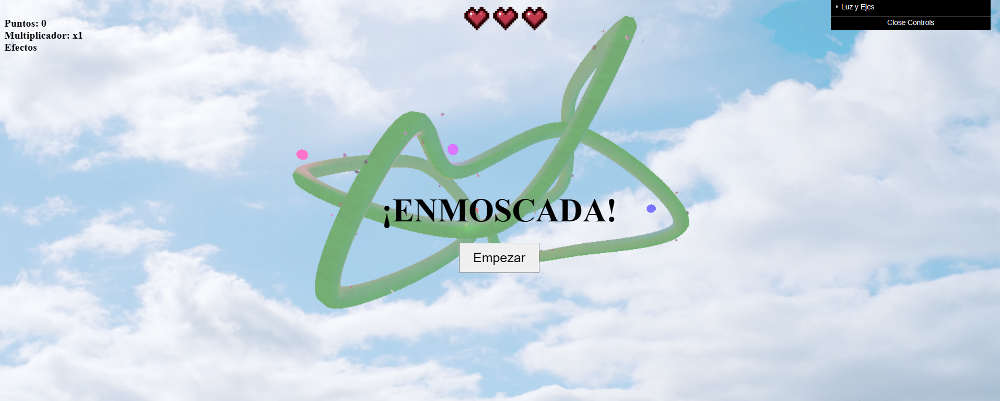
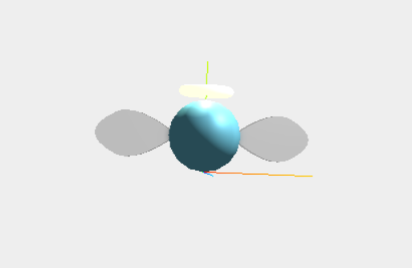
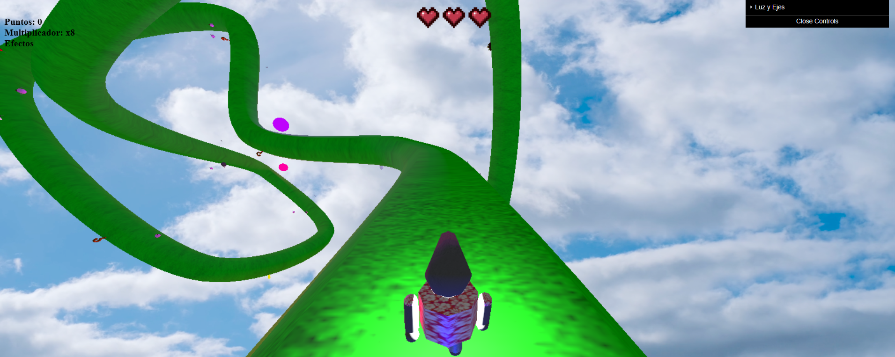
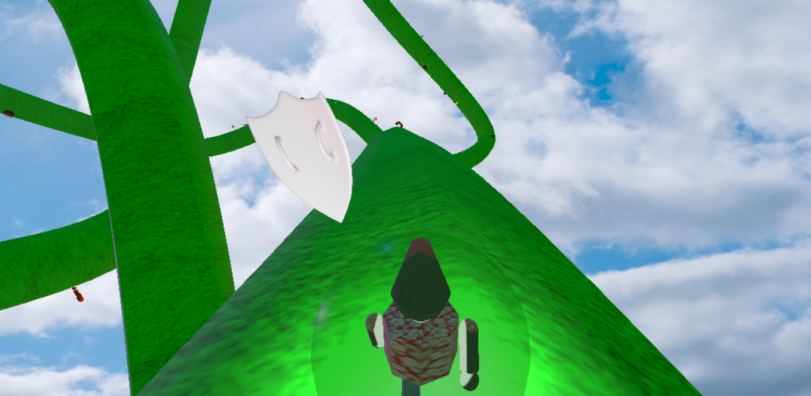
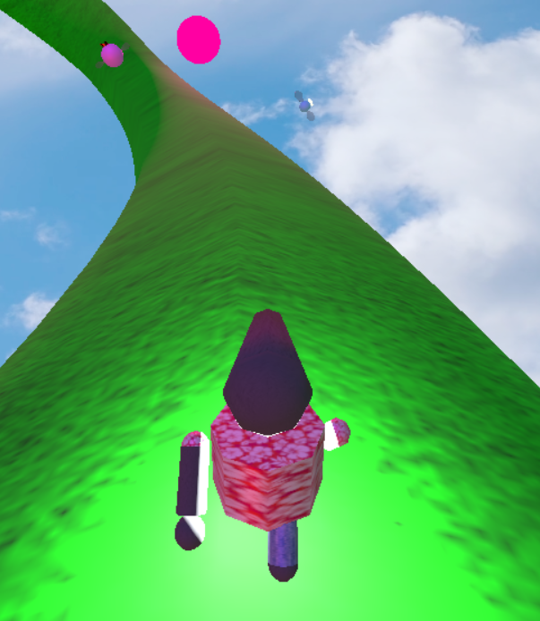

# Enmoscada


## Introducción

"Enmoscada" es un juego 3D al estilo "Mario Kart" desarrollado en JavaScript utilizando la biblioteca THREE.js y visualización con WebGL. El jugador dirige a un personaje a través de un circuito tubular cerrado (es decir, no posee final, es un recorrido cíclico), mientras que se encarga de eliminar al mayor número de moscas posibles a la vez que sobrevive a obstáculos en el terreno.

## Guía de Instalación

Para jugar a "Enmoscada", puedes seguir los siguientes pasos:

1.  **Clona el repositorio:**
    ```bash
    git clone https://github.com/jflrubio4/THREE.js-Game-Enmoscada.git
    ```
2.  **Navega al directorio del proyecto:**
    ```bash
    cd THREE.js-Game-Enmoscada
    ```
3.  **Inicia un servidor local:**
    Debido a las políticas de seguridad CORS de los navegadores, no puedes ejecutar el juego abriendo `index.html` directamente. Necesitas un servidor local.

    *   **Con Python:**
        *   Primero, verifica si tienes Python instalado abriendo una terminal y ejecutando: `python --version`.
        *   Si no está instalado, descárgalo desde [python.org](https://www.python.org/downloads/) y sigue las instrucciones. **Importante:** Asegúrate de marcar la casilla "Add Python to PATH" durante la instalación.
        *   Una vez instalado, inicia el servidor con este comando desde la raíz del proyecto:
            ```bash
            python -m http.server
            ```
    *   **Sin Python (usando VS Code):** Si prefieres no instalar Python, una alternativa sencilla es usar la extensión [Live Server](https://marketplace.visualstudio.com/items?itemName=ritwickdey.LiveServer) para Visual Studio Code. Simplemente instálala, haz clic derecho en el archivo `Juego/index.html` y selecciona "Open with Live Server".

4.  **Abre el juego en tu navegador:**
    Una vez que el servidor esté en marcha, abre la siguiente URL en tu navegador:
    [http://localhost:8000/Juego/](http://localhost:8000/Juego/)

## Modelos

El juego utiliza varios modelos 3D modelados con las diferentes herramientas que proporciona la biblioteca THREE.js, algunos de ellos importados y el resto creados manualmente, para el circuito, personaje, enemigos y objetos. Algunos de los modelos incluidos son:

*   [Personaje principal](./Modelos/Personaje/Personaje.js)
*   [Circuito](./Modelos/Circuito/Circuito.js)
*   Diferentes tipos de Moscas (Normal, Reina, Agresiva, Enigma, Luz)
*   [Bomba](./Modelos/Bomba/Bomba.js)
*   [Escudo](./Modelos/Escudo/Escudo.js)
*   [Nitro](./Modelos/Nitro/Nitro.js)
*   [Venus Atrapamoscas](./Modelos/Venus/Venus.js)

Los modelos importados para el juego son aquellos ubicados en la carpeta [Modelos](./Modelos), mientras que, si se desea ver cada modelo por separado con animaciones y mejor acabado, véase la carpeta [Modelos_Calidad](./Modelos_Calidad).

## Manual de Usuario (Resumido)

A continuación, aquí está una guía rápida para empezar a jugar:

*   **Objetivo:** Sobrevive el mayor tiempo posible en el circuito con un máximo de 3 vidas. Acumula puntos eliminando moscas y usa los objetos beneficiosos a tu favor.
*   **Controles:**
    *   **Movimiento:** Utiliza las teclas de flecha (o A/D) para moverte lateralmente y esquivar obstáculos en el suelo.
    *   **Disparar:** Haz clic con el ratón sobre las moscas para eliminarlas.
    *   **Cámara:** El juego dispone de dos cámaras: una global de todo el circuito y otra en tercera persona, simulando el movimiento del personaje. Alterna entre ellas con la tecla <kbd>Espacio</kbd>.
*   **Elementos Clave:**
    *   **Moscas:** Hay varios tipos, otorgando más o menos puntos en función del mismo.
    *   **Obstáculos:** Cuidado con las bombas, planchas de pinchos y otros peligros.
    *   **Objetos:** Recoge nitros como multiplicadores, escudos para protegerte y cajas de enigma para efectos sorpresa.
    *   **Efecto 'Enigma':** Perteneciente a un objeto y un tipo de mosca, este efecto otorga un estado beneficioso o perjudicial al jugador, pero no se sabe cual es hasta que se agarra el objeto o mata a la mosca correspondiente. ¡Pruébalos todos!

Para una explicación  más detallada de todas las mecánicas, objetos y enemigos, consulta la memoria del juego completa en el [Manual de Usuario](./_ENMOSCADA_.pdf). De igual forma, en este enlace puedes encontrar un vídeo de muestra del funcionamiento del juego: [Vídeo](./Video%20y%20Diagramas/Video%20y%20Diagramas/video.webm)

## Imágenes del Juego

Aquí se muestran algunas imagenes del juego:







